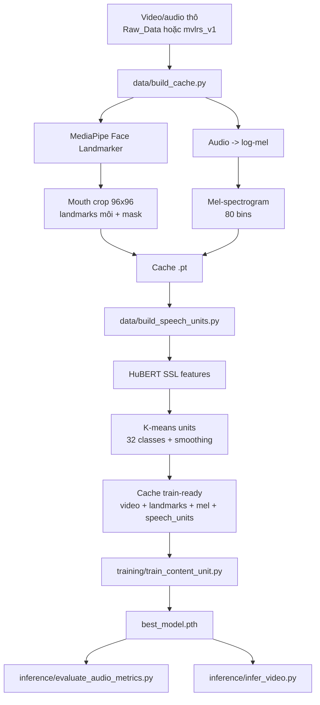
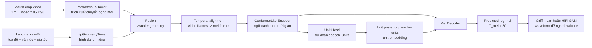
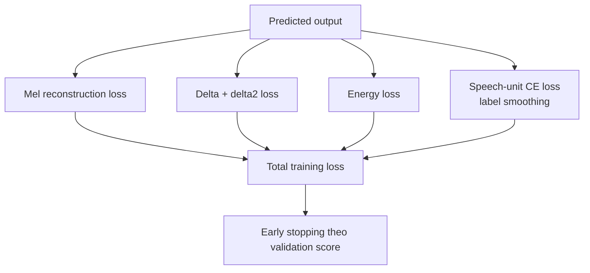

# Reconstruct Speech From Silent Video

Dự án này là pipeline khôi phục tiếng nói từ video câm. Phiên bản hiện tại chỉ giữ hướng tốt nhất: `ContentUnit`, tức mô hình dự đoán nội dung lời nói dưới dạng speech units trước, sau đó giải mã sang mel-spectrogram.

Checkpoint tốt nhất đang được giữ tại:

```text
checkpoints_content_unit_lrs2_10k_units32_l6_smooth5/best_model.pth
```

Nếu clone repo trên máy khác, cần tải checkpoint pretrained từ Google Drive và đặt đúng vị trí trên trước khi chạy inference/evaluate:

```text
https://drive.google.com/file/d/1fpGYgxU-9AxJMVhB9XGr_rc0IgfAUcNQ/view?usp=sharing
```

## Cấu Trúc Dự Án

```text
data/
  build_cache.py            # tạo cache .pt từ video/audio thô
  build_speech_units.py     # gắn HuBERT/k-means speech units vào cache
  dataset.py                # Dataset + collate cho train/eval
models/
  content_unit_model.py     # kiến trúc ContentUnit chính
  loss.py                   # MaskedMelLoss
  *_model.py                # các block phụ được ContentUnit tái sử dụng
training/
  train_content_unit.py     # script train chính
  content_unit_common.py    # helper riêng cho ContentUnit
  diagnose_ablation.py      # kiểm tra model có thật sự dùng video/landmark không
inference/
  infer_video.py            # predict audio từ một video câm
  evaluate_audio_metrics.py # evaluate SNR/PESQ/ESTOI/HiFi-GAN...
utils/
  audio.py
  common.py
  plotting.py
```

Các script train cũ có độ chính xác thấp hơn đã được loại khỏi `training`. Một số file model cũ vẫn còn trong `models/` vì `ContentUnit` dùng lại các block như visual tower, landmark tower và conformer block.

## Cài Đặt Môi Trường

Khuyến nghị dùng Linux, Python 3.10-3.12, GPU NVIDIA nếu train. Chạy từ root repo:

```bash
chmod +x setup_running.sh
./setup_running.sh
```

Script sẽ:

- tạo `.venv` nếu chưa có môi trường ảo;
- cài PyTorch CUDA nếu máy có `nvidia-smi`, CPU nếu không có GPU;
- cài `mediapipe==0.10.35`, `protobuf==5.29.6`, `numpy==2.0.2`;
- kiểm tra import các module chính của dự án.

Nếu máy dùng CUDA khác, có thể đổi index PyTorch:

```bash
TORCH_CUDA_INDEX_URL=https://download.pytorch.org/whl/cu128 ./setup_running.sh
```

Nếu đã có PyTorch trong môi trường hiện tại:

```bash
CREATE_VENV=0 INSTALL_TORCH=0 ./setup_running.sh
```

Nếu muốn cài thêm PESQ và SpeechBrain HiFi-GAN:

```bash
INSTALL_OPTIONAL_METRICS=1 ./setup_running.sh
```

Nếu muốn setup tự tải checkpoint tốt nhất về đúng thư mục:

```bash
DOWNLOAD_BEST_MODEL=1 ./setup_running.sh
```

Sau khi cài:

```bash
export PYTHONPATH="$PWD"
```

## Tải Checkpoint Pretrained

Model checkpoint không nên commit trực tiếp nếu vượt giới hạn GitHub. Tải file tại:

```text
https://drive.google.com/file/d/1fpGYgxU-9AxJMVhB9XGr_rc0IgfAUcNQ/view?usp=sharing
```

Đặt file về đúng đường dẫn:

```text
checkpoints_content_unit_lrs2_10k_units32_l6_smooth5/best_model.pth
```

Cách tải tự động bằng setup:

```bash
cd Reconstruct_Speech_from_Silent_Video
DOWNLOAD_BEST_MODEL=1 ./setup_running.sh
```

Cách tải thủ công:

```bash
cd Reconstruct_Speech_from_Silent_Video
python -m pip install gdown
mkdir -p checkpoints_content_unit_lrs2_10k_units32_l6_smooth5
python -m gdown "https://drive.google.com/uc?id=1fpGYgxU-9AxJMVhB9XGr_rc0IgfAUcNQ" \
  -O checkpoints_content_unit_lrs2_10k_units32_l6_smooth5/best_model.pth
```

Kiểm tra file đã đúng vị trí:

```bash
ls -lh checkpoints_content_unit_lrs2_10k_units32_l6_smooth5/best_model.pth
```

## Pipeline Xử Lý Dữ Liệu



Pipeline có hai tầng cache: tầng đầu lưu video/mel/landmarks, tầng thứ hai thêm `speech_units` để mô hình học nội dung phát âm rõ hơn.

### 1. Dữ liệu thô

`build_cache.py` quét đệ quy các sample có cấu trúc:

```text
Raw_Data/
  sample_000001/
    video.mp4
    audio.wav
  sample_000002/
    video.mp4
    audio.wav
```

Nếu dữ liệu gốc là LRS2/mvlrs_v1 dạng `main/<video_id>/<clip>.mp4`, cần chuẩn hóa trước về dạng mỗi sample có `video.mp4` và `audio.wav`, hoặc dùng cache `.pt` đã có trường `source_audio`.

### 2. Build cache video/mel

```bash
PYTHONPATH=. python -m data.build_cache \
  --raw-dir Raw_Data \
  --output-dir Processed_Data_R2INR_LRS2_10k \
  --overwrite \
  --frame-size 96 \
  --face-landmarker-model face_landmarker_v2_with_blendshapes.task
```

Mỗi file `.pt` chứa:

- `video`: mouth crop grayscale `[1, T_video, 96, 96]`;
- `landmarks`: 40 điểm môi + đạo hàm bậc 1/bậc 2;
- `mel`: log-mel `[T_mel, 80]`;
- `video_mask`, `mel_mask`, thời gian frame, đường dẫn `source_video`, `source_audio`.

Nếu MediaPipe không chạy, code sẽ fallback center crop, nhưng chất lượng thường giảm mạnh.

### 3. Build speech units

Speech units là nhãn rời rạc được tạo từ đặc trưng HuBERT + k-means. Chúng đóng vai trò mục tiêu nội dung phát âm, giúp mô hình học "nghe được chữ" thay vì chỉ khớp mel trung bình.

Cấu hình tốt nhất hiện tại dùng `32` units và smoothing window `5`:

```bash
PYTORCH_ALLOC_CONF=expandable_segments:True PYTHONPATH=. \
python -m data.build_speech_units \
  --data-dir Processed_Data_R2INR_LRS2_10k \
  --output-dir Processed_Data_R2INR_LRS2_10k_units32_l6_smooth5_trainfit \
  --num-units 32 \
  --fit-subset train \
  --fit-val-ratio 0.05 \
  --smooth-window 5 \
  --device cuda
```

Output vẫn là `.pt`, nhưng có thêm:

```text
speech_units
num_speech_units
speech_unit_source
```

## Kiến Trúc Mô Hình ContentUnit

Mục tiêu của kiến trúc là ưu tiên nội dung lời nói, không cố khôi phục đúng chất giọng từng người.





Luồng chính:

1. `MotionVisualTower` nhận mouth crop video để trích xuất chuyển động môi.
2. `LipGeometryTower` hoặc landmark tower nhận landmark môi để lấy hình dạng miệng.
3. Visual feature và geometry feature được fusion.
4. Encoder `ConformerLiteBlock` học ngữ cảnh theo thời gian.
5. Unit head dự đoán `speech_units`.
6. Unit posterior hoặc teacher units được đưa vào `unit_embedding`.
7. Decoder dự đoán log-mel `[T_mel, 80]`.

Loss chính:

- mel reconstruction;
- delta/delta2 để giữ chuyển động phổ;
- energy loss;
- speech-unit cross entropy;
- label smoothing để giảm overfit;
- validation score ưu tiên unit loss, có thêm mel score nhỏ.

Checkpoint tốt nhất hiện tại được train với `geometry_mode=basic`, `num_units=32`, `dropout=0.25`.

## Quy Trình Huấn Luyện

Lệnh tái lập hướng tốt nhất hiện tại:

```bash
PYTORCH_ALLOC_CONF=expandable_segments:True PYTHONPATH=. \
python -m training.train_content_unit \
  --data-dir Processed_Data_R2INR_LRS2_10k_units32_l6_smooth5_trainfit \
  --output-dir checkpoints_content_unit_lrs2_10k_units32_l6_smooth5 \
  --device cuda \
  --epochs 40 \
  --batch-size 4 \
  --val-batch-size 4 \
  --val-ratio 0.05 \
  --max-frames 64 \
  --random-crop \
  --dim 256 \
  --spatial-tokens 2 \
  --encoder-layers 2 \
  --decoder-layers 2 \
  --heads 4 \
  --geometry-mode basic \
  --dropout 0.25 \
  --lr 3e-5 \
  --weight-decay 3e-4 \
  --unit-loss-weight 0.15 \
  --geometry-unit-loss-weight 0 \
  --unit-label-smoothing 0.10 \
  --unit-teacher-min 0.25 \
  --unit-teacher-decay-epochs 40 \
  --mismatch-loss-weight 0 \
  --unit-mismatch-loss-weight 0 \
  --early-stop-patience 5 \
  --early-stop-min-delta 0.002 \
  --amp \
  --num-workers 2 \
  2>&1 | tee logs/train_content_unit_lrs2_10k_units32_l6_smooth5.log
```

Nếu gặp lỗi NCCL trong môi trường conda, thêm `LD_LIBRARY_PATH` trỏ tới thư mục `nvidia/nccl/lib` của môi trường đó trước lệnh train.

Train script chia train/val bằng `seed=42`: shuffle danh sách `.pt`, lấy `val_ratio` làm validation, còn lại là train.

Checkpoint lưu trong output dir:

```text
best_model.pth
last_model.pth
history.json
mel_epoch_*.png
```

## Chạy Thử Inference Một Video Câm

```bash
PYTHONPATH=. python -m inference.infer_video \
  --video /path/to/test_video.mp4 \
  --checkpoint checkpoints_content_unit_lrs2_10k_units32_l6_smooth5/best_model.pth \
  --output-dir inference_outputs/test_video \
  --device cuda \
  --face-landmarker-model face_landmarker_v2_with_blendshapes.task
```

Output:

```text
*_pred_mel.npy
*_pred_mel.png
*_units.txt
*_griffinlim.wav
*_meta.json
```

File wav mặc định dùng Griffin-Lim để nghe nhanh. Nếu cần âm tự nhiên hơn khi evaluate, dùng HiFi-GAN trong script metric.

## Đánh Giá Ablation

Kiểm tra model có thật sự dùng video/landmark không:

```bash
PYTHONPATH=. python -m training.diagnose_ablation \
  --data-dir Processed_Data_R2INR_LRS2_10k_units32_l6_smooth5_trainfit \
  --checkpoint checkpoints_content_unit_lrs2_10k_units32_l6_smooth5/best_model.pth \
  --device cuda \
  --batch-size 2 \
  --max-frames 64 \
  --max-batches 30 \
  --include-units
```

Kỳ vọng:

- `zero_video` loss tăng rõ;
- `reverse_time` loss tăng;
- `mismatch_sample` loss tăng;
- `unit_acc` của normal cao hơn các biến thể phá video.

## Đánh Giá Audio Metrics

Evaluate trên validation split:

```bash
PYTHONPATH=. python -m inference.evaluate_audio_metrics \
  --data-dir Processed_Data_R2INR_LRS2_10k_units32_l6_smooth5_trainfit \
  --checkpoint checkpoints_content_unit_lrs2_10k_units32_l6_smooth5/best_model.pth \
  --output-dir eval_audio_metrics_val_content_unit \
  --device cuda \
  --split val \
  --val-ratio 0.05 \
  --max-frames 64 \
  --batch-size 1 \
  --vocoder griffinlim \
  --metrics snr,pesq,estoi
```

Dùng HiFi-GAN:

```bash
python -m pip install speechbrain

PYTHONPATH=. python -m inference.evaluate_audio_metrics \
  --data-dir Processed_Data_R2INR_LRS2_10k_units32_l6_smooth5_trainfit \
  --checkpoint checkpoints_content_unit_lrs2_10k_units32_l6_smooth5/best_model.pth \
  --output-dir eval_audio_metrics_val_content_unit_hifigan \
  --device cuda \
  --split val \
  --val-ratio 0.05 \
  --max-frames 64 \
  --batch-size 1 \
  --vocoder speechbrain-hifigan \
  --metrics snr,pesq,estoi
```

Kết quả lưu tại:

```text
audio_metrics.csv
summary.json
```

## Lỗi Thường Gặp

### Không import được module dự án

Chạy từ root repo:

```bash
export PYTHONPATH=.
```

### MediaPipe lỗi protobuf/runtime_version

Chạy lại setup:

```bash
python -m pip install --force-reinstall "numpy==2.0.2" "protobuf==5.29.6" "mediapipe==0.10.35"
```

### PESQ hoặc HiFi-GAN chưa cài được

Inference vẫn chạy được bằng Griffin-Lim. Nếu cần PESQ/HiFi-GAN:

```bash
python -m pip install pesq speechbrain
```

### CUDA hết VRAM

Giảm:

```text
--batch-size 2
--val-batch-size 2
--max-frames 48
```

### Không có `source_audio` khi build speech units

`build_speech_units.py` cần mỗi `.pt` có `source_audio`. Nếu cache cũ thiếu trường này, cần patch cache hoặc build lại cache từ dữ liệu thô.

## Ghi Chú Môi Trường

PyTorch nên cài bằng selector chính thức theo CUDA của máy. `setup_running.sh` mặc định dùng CUDA wheel `cu126`, có thể đổi bằng `TORCH_CUDA_INDEX_URL`. MediaPipe hiện dùng bản `0.10.35` để tránh lỗi không tìm thấy wheel trên Python mới và tránh xung đột protobuf.
